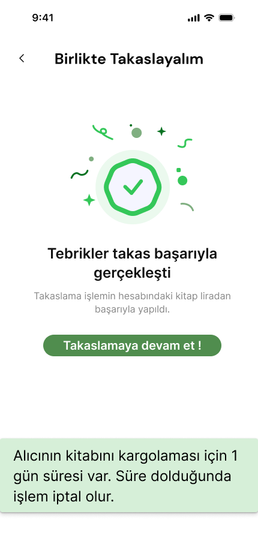

  <html>
  <body>

  

  # **Takım İsmi**
#### Takım Flutter 13
  # **Ürün İsmi**
#### Chaboo
	
  ## Takım Üyeleri
  <table>
    <tr>
      <th>İsim</th>
      <th>Görev</th>
      <th>Sosyal Medya</th>
    </tr>
    <tr>
      <td>Furkan Kül</td>
      <td>Scrum Master - UI/UX </td>
      <td>
        
        
      </td>
    </tr>
    <tr>
      <td>Gökhan Polat </td>
      <td>Product Owner</td>
      <td>
        
        
      </td>
    </tr>
    <tr>
      <td>Fadime Bulduklu</td>
      <td>Developer</td>
      <td>
        
        
      </td>
    </tr>
    <tr>
      <td>Ezgi Eyice</td>
      <td>Developer</td>
      <td>
        
        
      </td>
    </tr>
    <tr>
      <td>Görkem Demir</td>
      <td>Developer</td>
      <td>
        
        
      </td>
    </tr>
  </table>

  ## Ürün Açıklaması
  ChaBoo, kitap tutkunlarının okudukları kitapları takas etmelerini sağlayan, yapay zeka destekli bir platformdur. ChaBoo adlı sohbet robotumuz, kişiselleştirilmiş kitap önerileri sunarak, benzer okuma zevkine sahip kullanıcıları bir araya getirerek ve takas sürecini kolaylaştırarak kitapseverlere yeni keşifler yapma fırsatı sunar. ChaBoo ile hem bütçenizi koruyabilir hem de kitaplığınızı sürdürülebilir bir şekilde genişletebilirsiniz.
  
 
 

    
<h2>Ürün Özellikleri</h2>

        <h3>Kitap Önerileri:</h3>
        
ChaBo, okuma geçmişinizi ve tercihlerinizi analiz ederek size özel kitap önerileri sunar, böylece daha önce fark etmediğiniz kitaplarla tanışabilirsiniz.

        <h3>Sohbet Robotu Rehberliğinde Takas:</h3>
        
ChaBoo AI Yardım, kitap seçimi, diğer kullanıcılarla iletişim ve takas detaylarının düzenlenmesi gibi tüm süreçte size rehberlik eder.

        <h3>Kişiselleştirilmiş Kitap Profilleri:</h3>
        
En sevdiğiniz türleri, yazarları ve kitapları sergileyen bir profil oluşturarak benzer ilgi alanlarına sahip kitapseverlerle bağlantı kurabilirsiniz.

        <h3>Güvenli ve Kullanışlı:</h3>
        
ChaBoo, kişisel bilgilerinizin güvenliğini ön planda tutar ve kitap takası işlemlerinizi kolaylıkla yönetmenizi sağlar.

    
<h2>Hedef Kitle</h2>

    
ChaBoo, kitaplara tutkuyla bağlı olan ancak bütçelerini ve çevreyi de düşünen okuyucular için tasarlanmıştır. Özellikle şu kişilere hitap eder:
  <ul>
    <li>Y ve Z Kuşağı</li>
    <li>Bütçe Dostu Okurlar</li>
    <li>Çevre Dostu Tüketiciler</li>
    <li>Kitap Kulüpleri ve Okuma Grupları</li>
  </ul>

  

   <h1>SPRINTLER</h1>
  

    
<h1>Sprint 1</h1>

  

    
<h3>Sprint 1 - Ekran Görüntüleri</h3>

  <table style="width: 100%;">
    <tr>
      <td colspan="4" style="text-align: center;"><h2>Giriş / Kayıt Ol</h2></td>
    </tr>
    <tr>
      <td style="width: 25%;"></td>
      <td style="width: 25%;"></td>
      <td style="width: 25%;"></td>
      <td style="width: 25%;"></td>
    </tr>
    <tr>
      <td colspan="4" style="text-align: center;"><h2>Akış / Takas</h2></td>
    </tr>
    <tr>
      <td style="width: 25%;"></td>
      <td style="width: 25%;"></td>
      <td style="width: 25%;"></td>
    </tr>
    <tr>
      <td colspan="4" style="text-align: center;"><h2>Profil / Ayarlar</h2></td>
    </tr>
    <tr>
      <td style="width: 25%;"></td>
      <td style="width: 25%;"></td>
    </tr>
    <tr>
      <td colspan="4" style="text-align: center;"><h2>Ürün Ekleme / Yapay Zeka</h2></td>
    </tr>
    <tr>
      <td style="width: 25%;"></td>
      <td style="width: 25%;"></td>
      <td style="width: 25%;"></td>
    </tr>
  </table>
  
  
  

    
<h3>Sprint 1 - Whatsapp Ekran Görüntüleri / Jira Pano </h3>

    
    
    
    
  

  

    
<h3>Sprint 1 - Burndown Chart</h3>

    
    - **Araçlar ve Teknoloji**:
    
- Proje yönetimi için Jira kullanılacak.
- UI tasarımı için Figma kullanılacak.
- Giriş yöntemleri google ve facebook olarak belirlendi.
  - **Sprint Bitiminde Ulaşılmak İstenen Puan**: 155
  - **Puan Tamamlama Oranı**: `(155'in hepsi başarıyla tamamlandı)` 1. Sprintde puanlar zorluklara göre belirlendi. Takımın toplantı yapma bir araya gelme konusunda çevresel faktörlerin etkisiyle zorlandığı anlaşıldı bu yüzden "önemli" etiketli görevler 20 puan, uygulamayla alakalı bilgiler 10 puan, UI/UX tasarımları 15 puan olarak sonuçlandırıldı.
  - **Daily Scrum**: https://github.com/furkanava/Google-Bootcamp/blob/3c801e862b22f67e44985fb8755ffd60934e46fb/Bootcamp/scrum/dailyscrum.docx
  - **Backlog URL:**: https://1furkan.atlassian.net/jira/software/projects/SCRUM/list
  - **Sprint Review:**
    - Takımda iletişim eksikliği ve toplantılarda bir araya gelmede sorunlar yaşandığı belirlendi. Bir sonraki sprint için daha koordineli hareket etmeye karar verildi

    - Kargo süreçleri için bir ön araştırma ve kamu/özel teslimat şirketleriyle anlaşma için görüşmeler yapılması planlandı.

    - Sprint sonunda figma, jira kullanımı konusunda daha çok pratik yapma kararı aldık.
    

  - **Katılımcılar :** `Furkan Kül`, `Gökhan Polat`, `Ezgi Eyice`, `Fadime Bulduklu`, `Görkem Demir`
  - **Retrospective:**
    - Sonraki adımımızda takas için sadece kargo mu ? elden birebir teslimat mı ? yoksa "esnaf noktası" uygulaması mı? yapılmasıyla ilgili karar için toplantı öngörüldü.

    - Firebase konusunda hızlı bir geliştirme yapılacak bu konuda takım işbirliği içerisinde olacak.

    - Uygulamanın gelirleri konusunda araştırma yapılacak.

    - UI/UX gözden geçirilecek

    - Ezgi yazılım konusunda takım lideri olacak.(taskları o dağıtacak ekranlar vb.)

    - Süreç github üzerinden yürütülecek.(mümkünse).
  

  

 

    
<h1>Sprint 2</h1>

  

    
<h3>Sprint 2 - Ekran Görüntüleri</h3>

  
  <table style="width: 100%;">
     <tr>
      <td colspan="4" style="text-align: center;"><h2>Akış Ekranları</h2></td>
    </tr>
    <tr>
      <td style="width: 25%;"></td>
      <td style="width: 25%;"></td>
    </tr>
     <tr>
      <td colspan="4" style="text-align: center;"><h2>Yeni Takas Ekranları</h2></td>
    </tr>
    <tr>
      <td style="width: 25%;"></td>
      <td style="width: 25%;"></td>
    </tr>
    <tr>
      <td colspan="4" style="text-align: center;"><h2>Mesaj ve Profil Güncellendi</h2></td>
    </tr>
    <tr>
      <td style="width: 25%;"></td>
      <td style="width: 25%;"></td>
      <td style="width: 25%;"></td>
    </tr>
  </table>
  
  

  

    
<h3>Sprint 2 -  Jira Pano </h3>

    
  

  

    
<h3>Sprint 2 - Burndown Chart</h3>

    

  - **Sprint Bitiminde Ulaşılmak İstenen Puan**: 49
  - **Puan Tamamlama Oranı**: `(49 puandan 35'i tamamlandı)` 2. Sprintde puanlar zorluklara göre belirlendi. Ezgi'nin önerisiyle puanlar literatürdeki gibi fibonacci sayılarına göre hazırlandı. Eksik puanlar sprint 3'de tamamlanacak.
  - **Daily Scrum**: https://github.com/furkanava/Google-Bootcamp/blob/3c801e862b22f67e44985fb8755ffd60934e46fb/Bootcamp/scrum/dailyscrum.docx
  - **Backlog URL:** 
https://1furkan.atlassian.net/jira/software/projects/SCRUM/list
  - **Sprint Review:**
    - Takas yönteminin belirlenmesi konusunda takım ortak kararla eğer kullanıcı takas teklifini onaylarsa mesaj bölümünün açılması ve kullanıcıların kendi isteğine göre takas yapması(kargo/buluşma) belirlendi

    - Kitap Lira uygulamasından vazgeçildi. UI/UX buna göre değiştirildi. Yeni ekranlar tasarlandı.
    

  - **Katılımcılar :** `Furkan Kül`, `Gökhan Polat`, `Ezgi Eyice`, `Fadime Bulduklu`, `Görkem Demir`
  - **Retrospective:**
    - Sonraki çalışmamızda sürenin az kaldığı ve takım olarak yavaş ilerlediğimiz için hızlanmaya karar verdik.

    - Akış ekranı geliştirmesi yapılacak bu konuda takım işbirliği içerisinde olacak.

    - Uygulamanın gelirleri konusunda araştırma yapılacak.

    - UI/UX son kez gözden geçirilecek.

    - Yapay Zeka eğitilecek.

**Sprint Notları:**  
    - Sprint 2'de ekranların yavaş geliştirilmesi dolayısıyla son sprint için aktif ve hızlı çalışılacak  
    - Eğer eklenecekse kargo vb. süreçlerin uygulama tamamlandıktan sonra düşünülmesi. 
    - Takım içi koordinasyon ve işbirliğinin arttırılması

  

  

  

    
<h1>Sprint 3</h1>

  

    
<h3>Sprint 3 - Ekran Görüntüleri</h3>

  
  <table style="width: 100%;">
     <tr>
      <td colspan="4" style="text-align: center;"><h2>Ekranlar Güncellendi</h2></td>
    </tr>
    <tr>
      <td style="width: 25%;"></td>
      <td style="width: 25%;"></td>
    </tr>
     <tr>
      <td colspan="4" style="text-align: center;"><h2>Yeni Takas Ekranları</h2></td>
    </tr>
    <tr>
      <td style="width: 25%;"></td>
      <td style="width: 25%;"></td>
    </tr>
    <tr>
      <td colspan="4" style="text-align: center;"><h2>Mesaj ve Profil Güncellendi</h2></td>
    </tr>
    <tr>
      <td style="width: 25%;"></td>
      <td style="width: 25%;"></td>
      <td style="width: 25%;"></td>
    </tr>
  </table>
  
  

  

    
<h3>Sprint 3 -  Whatsapp Ekran Görüntüleri </h3>

  
  

  

    
<h3>Sprint 3 - Jira-Burndown Chart</h3>

    
    

  - **Sprint Bitiminde Ulaşılmak İstenen Puan**: 36
  - **Puan Tamamlama Oranı**: `(36 puandan 31'i tamamlandı)` 3. Sprintde de puanlar zorluklara göre belirlendi. Fibonacci sayılarına göre hazırlandı. Eksik puanlar sprint 3'de tamamlandı. Mesajlar kısmı yetişmedi. 3 Sprintde toplam hedeflediğimiz 240 puanın 221'ini başarıyla tamamladık.
  - **Daily Scrum**: https://github.com/furkanava/Google-Bootcamp/blob/3c801e862b22f67e44985fb8755ffd60934e46fb/Bootcamp/scrum/dailyscrum.docx
  - **Backlog URL:** 1furkan.atlassian.net/jira/software/projects/SCRUM/list
  - **Sprint Review:**
    - Kargo uygulamasından vazgeçildi. Kullanıcıların kendi isteklerine göre takaslar planlaması düşünüldü.

    - Takım içi iş yükü ve yoğunluklar sebebiyle önemli ekranlardan mesaj kısmı yetişmedi
    

  - **Katılımcılar :** `Furkan Kül`, `Gökhan Polat`, `Ezgi Eyice`, `Fadime Bulduklu`, `Görkem Demir`
  - **Retrospective:**
    - Sonraki çalışmamızda sürenin az kaldığı ve takım olarak yavaş ilerlediğimiz için hızlanmaya karar verdik.

    - Proje hedeflerine tam olarak ulaşamasakta yakınlaştığımızı konuştuk.

    - Mesajlar ekranı için 5 why tekniğiyle müzakere ettik ve sonuç olarak iki taraflı veri akışı gerektiğinden ve iş yoğunluğundan dolayı yetiştiremediğimizi öğrendik. 

    - Takımdaki herkesin tasarım, kodlama, proje yönetimi alanlarında iyi kazanımlar elde ettiğinden bahsettik.    
     **Sprint Notları:**  
    - Sprint 3'de iş yükünü iyi ayarlayamadık  
    - 3 Developerımız da yoğun olduğu için mesajlar ekranı ve bazı ekranları planladığımız gibi yetiştiremedik. Bazıları fonksiyonsuz oldu. 
       
  

  

</body>
</html>
